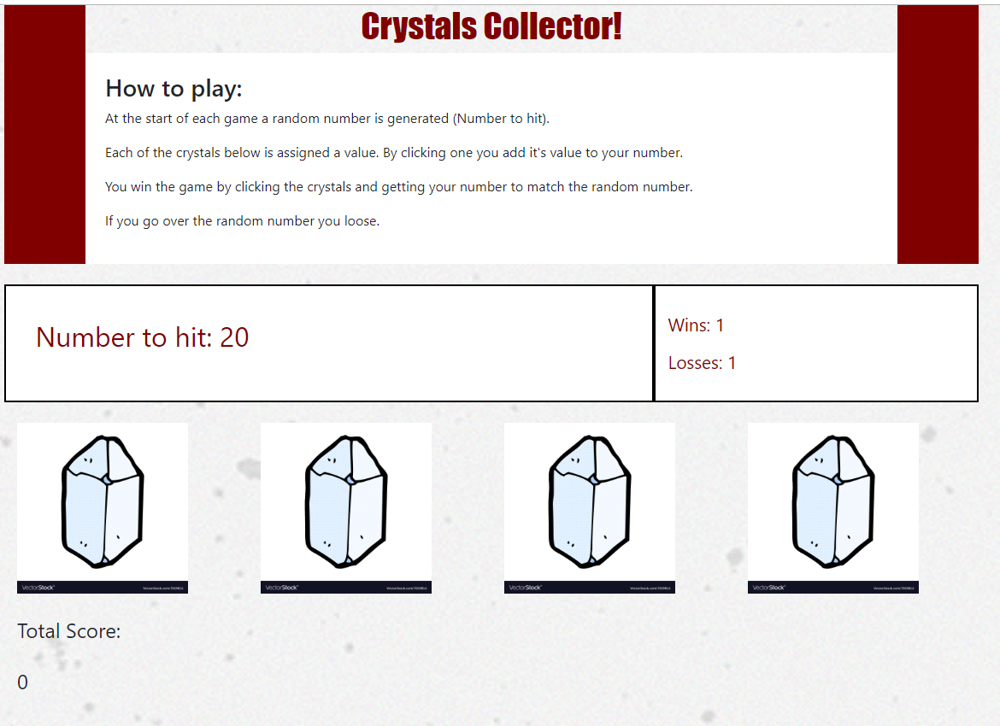

# unit-4-game


# Project Description:
Player interacts with the web page to try to get to the exact number (which is between 19 and 120) displayed on the screen by clicking on the crystals. This number is randomly generated anew each game.
Play proceeds as follows:
```
 1. Click a crystal. Each crystal is assigned a random number between 1 and 12. (Values are randomly generated anew each game.)
 2. When a crystal is clicked it's number is added to the users current number. 
 3. If the running total of the users current number exceeds the random number the player looses.
 4. If the running total reaches the exact value of the random number the player wins.
```
 
 ### Game Link: https://kbrowngithub.github.io/unit-4-game/
 
 # Technologies
 The technologies used in the creation of this application are:
 ```
 - HTML
 - CSS
 - Bootstrap
 - Javascript
 - jQuery
 ```
 
 # Features
 ##### Game Screen
```
    - Directions are displayed
    - Randomly generated number is displayed anew each game.
    - Wins/Losses counters are tracked and displayed.
    - Total score for the current round is displayed.

 ```
 
 